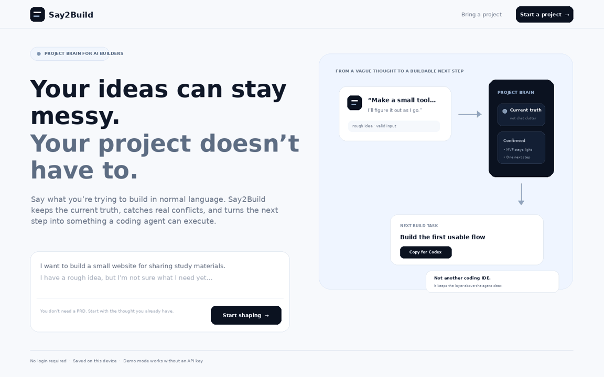
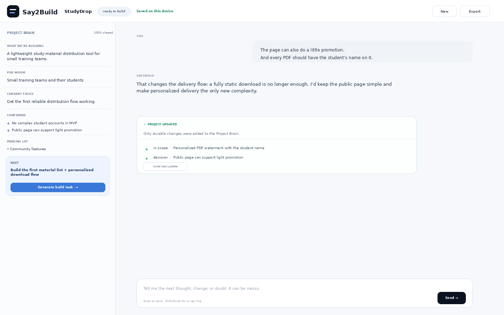

<div align="center">
  

# Say2Build

**Build freely. Don’t let the project forget.**

A lightweight Project Brain for people building with AI.

[Try the local demo](#quick-start) · [Product brief](docs/PRODUCT.md) · [Architecture](docs/ARCHITECTURE.md) · [中文完整规格](docs/CANONICAL_SPEC.zh-CN.md)

<p>
  
  = 20" />
  
</p>
</div>


## Your chat can be messy. Your project doesn't have to be.

AI coding agents are great at executing a task. Beginner AI builders still lose projects inside long conversations: ideas change, old decisions stay alive, small experiments accidentally become “requirements,” and the next useful step gets harder to see.

Say2Build keeps a small layer **above** the coding agent:

```text
Without Say2Build                 With Say2Build

Idea                              Idea
 ↓                                 ↓
Chat                              Natural chat
 ↓                                 ↓
More chat                         Project Brain
 ↓                                 ↓
Conflicting decisions             Current truth
 ↓                                 ↓
“What are we building now?”       One next task
                                    ↓
                                  Codex / Claude Code
```

It is intentionally **not another coding IDE**. Say2Build helps you decide what the project currently is; Codex, Claude Code, Cursor, or another coding agent can still do the implementation.

## Demo



The built-in demo works without an API key. Start with something rough, for example:

> I want to build a small tool for sharing study materials. I know roughly what I want, but I haven't figured out the flow yet.

Then change your mind:

> Every PDF should include the student's name.

Say2Build will update durable project truth, keep speculative ideas separate, surface a real conflict when necessary, and eventually prepare one focused build task.



## What it does

- **Starts from vague language.** No PRD or prompt-engineering prerequisite.
- **Asks fewer questions.** Low-risk assumptions are handled automatically; high-impact choices get a recommendation.
- **Maintains current truth.** The Project Brain is a compact state, not a transcript summary.
- **Handles changed minds.** Old confirmed decisions can be superseded instead of silently coexisting.
- **Keeps ideas out of MVP by default.** “Maybe later” belongs in the parking lot, not current scope.
- **Always shows one Next Action.** Planning should move toward building, testing, validating, or releasing.
- **Generates coding-agent artifacts.** Export `PROJECT.md`, `AGENTS.md`, a focused `task-xxx.md`, and a machine-restorable project JSON.
- **Works locally without login.** The MVP stores projects on the device.

## Quick start

Requirements: **Node.js 20+**.

```bash
git clone https://github.com/Henry369-0/say2build.git
cd say2build
npm start
```

Open `http://localhost:3000`.

There are **no runtime npm dependencies** in v0.1, so no package installation is required before the first run.

### Demo mode — zero configuration

Just run `npm start`. If no model key is configured, the app uses its deterministic Demo Brain so the full interface, state updates, task generation, persistence, and export flow remain testable.

### Live AI mode

Copy the environment template and set a server-side key:

```bash
cp .env.example .env
```

Then export the values before starting the server, or configure them in your deployment environment:

```bash
export OPENAI_API_KEY="..."
export OPENAI_MODEL="gpt-5.6"
npm start
```

The browser never receives the provider key. If live AI is unavailable, the client falls back to Demo Brain rather than losing the project state.

## The core architecture

The most important rule is simple:

> **AI proposes the change. Deterministic code applies the change.**

```text
Current Project Brain + latest thought
                 │
                 ▼
        Conversation Interpreter
                 │
                 ▼
          BrainTurnResult
         proposed changes only
                 │
                 ▼
         Validation + Reducer
                 │
                 ▼
        Project Brain (truth)
          │        │       │
          ▼        ▼       ▼
    Consensus  Artifacts  Next Action
```

The model is not allowed to rewrite the whole project after every message. That makes changed requirements, conflict handling, undo, regression tests, and long conversations much easier to reason about.

Read the full [architecture notes](docs/ARCHITECTURE.md).

## Project artifacts

### `PROJECT.md`

The human-readable current project truth: who it is for, problem, current goal, MVP scope, non-goals, decisions, constraints, stage, and next action.

### `AGENTS.md`

Only stable information that a coding agent should know across many tasks. Temporary task instructions do not belong here.

### `task-xxx.md`

One narrow handoff designed for one independent coding-agent session:

```md
# Task: Build the first material distribution flow

## Objective
...

## In scope
...

## Out of scope
...

## Preserve
...

## Acceptance criteria
...

## When finished
1. What changed
2. Files changed
3. How you verified it
4. Anything unresolved
```

### `say2build.project.json`

The machine-restorable form of the Project Brain. Markdown is for humans and agents; JSON preserves ids, sources, statuses, and supersession relationships.

## Behavioral checks

Say2Build has fixed evaluation scenarios for the failure modes it is supposed to prevent:

1. vague idea;
2. user says “you decide”;
3. changed requirement;
4. real conflict;
5. feature creep;
6. tiny change that should not persist;
7. demo → usable-product stage reminder;
8. long conversation with many revisions.

Run the deterministic checks:

```bash
npm test
npm run check
```

## Repository map

```text
say2build/
├── public/                  # browser app + Project Brain modules
├── server/                  # optional live-AI adapters
├── api/                     # serverless API wrappers
├── tests/                   # deterministic reducer/artifact tests
├── evals/                   # behavioral fixtures
├── examples/                # sample project state
├── docs/                    # product, architecture, canonical spec
├── .github/workflows/       # CI
├── AGENTS.md
├── CONTRIBUTING.md
├── SECURITY.md
└── LICENSE
```

## What Say2Build deliberately does not do

The MVP does not include a code editor, terminal, repository browser, automatic code execution, multi-agent orchestration, team project management, billing, or a replacement for Codex / Claude Code.

Those capabilities can look impressive while making the product less useful to its target user. The first question is smaller: **can a beginner keep thinking naturally while the project itself becomes clearer and more executable?**

## Deployment

- **Local / self-hosted:** `npm start`.
- **Live AI deployment:** deploy the full repository on a server/serverless host and set `OPENAI_API_KEY` server-side.

## Roadmap

After the core behavior is proven:

- existing-project recovery from more artifacts;
- GitHub repository connection;
- direct coding-agent handoff;
- cloud sync / account as an optional layer;
- richer `DESIGN.md` support;
- project templates and personalization.

## Contributing

See [CONTRIBUTING.md](CONTRIBUTING.md). The most valuable contributions are not “more features” by default — they are better reducer invariants, eval cases, accessibility, artifact quality, and evidence that the Project Brain genuinely helps people finish projects.

## License

MIT © 2026 Say2Build contributors.
